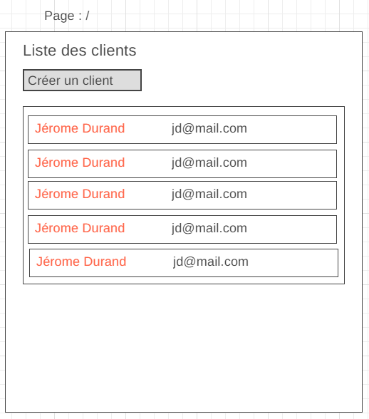
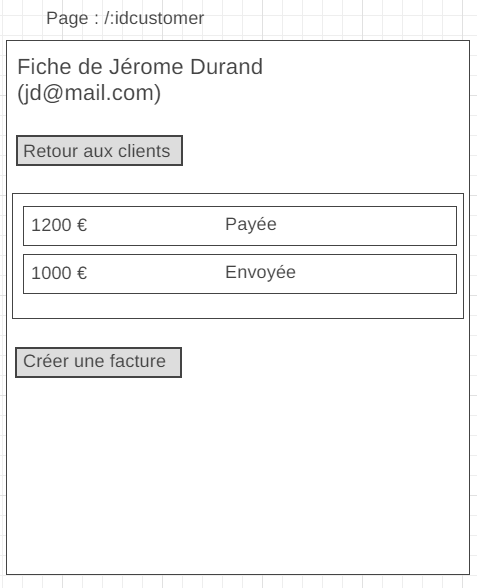
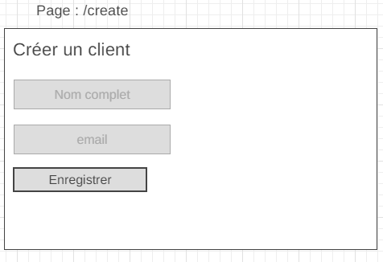
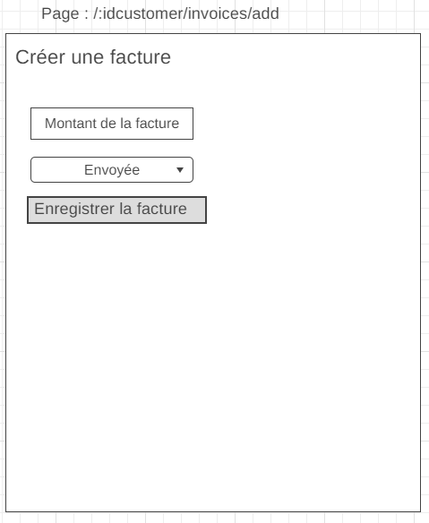

# Application de gestion de clients et factures

Vous allez développer pour nous une application **_réactive_** nous permettant de gérer nos clients ainsi que leurs factures. Les données seront stockées sur un serveur distant.

## Lister les clients

L'utilisateur pourra consulter la liste de ses clients directement sur la page d'accueil. Pour chaque client affiché, je dois avoir un lien qui amène sur l'URL `/:id` (avec :id remplacé par l'identifiant du client, exemple : /1 /12 /230) qui amène à une page d'informations sur le client.

Cette page devra aussi contenir un lien menant vers l'URL `/create` qui permettra de créer un nouveau client.

## Voir le détails d'un client

L'utilisateur pourra consulter les détails d'un client sur l'URL `/:id` (avec :id remplacé par l'identifiant du client, exemple : /1 /12 /230)

La page devra afficher toutes les informations du client ainsi qu'une liste de ses factures sous la forme d'un tableau HTML (une ligne de tableau par facture).

Un lien doit être présent afin de rediriger l'utilisateur vers l'URL `/:id/invoices/add` (avec :id étant l'identifiant du client) qui affichera une formulaire permettant de créer une facture.

## Création d'un client

L'utilisateur pourra accéder à un formulaire lui permettant de créer un client via l'URL `/create`.

Il pourra y accéder en tapant directement l'URL dans son navigateur ou alors en cliquant sur un lien qui doit être présent sur la page d'accueil de l'application.

Lors de la soumission de ce formulaire, les données du client devront être transmises à l'API distante, et l'application devra rediriger automatiquement sur la page d'accueil de l'application.

## Création d'une facture pour un client donné

L'URL `/:id/invoices/create` (avec :id étant l'identifiant d'un client) doit permettre d'accéder à un formulaire de création d'une facture.

Lorsque le formulaire est soumis, l'application redirige vers la page de détails du client (`/:id`) et on doit constater que la facture nouvellement créée est bien présente sur la fiche du client.

Clients
List all clients

Method: GET
Route: /clients
Action: Retrieves a list of all clients.
View details of a specific client

Method: GET
Route: /clients/:id
Action: Retrieves details for a specific client by ID.
Create a new client

Method: POST
Route: /clients
Action: Adds a new client to the database.

Invoices
List all invoices for a specific client

Method: GET
Route: /clients/:id/invoices
Action: Retrieves all invoices associated with a specific client.
Create a new invoice for a specific client

Method: POST
Route: /clients/:id/invoices
Action: Adds a new invoice associated with a specific client.
